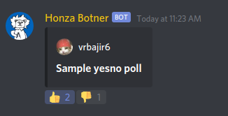
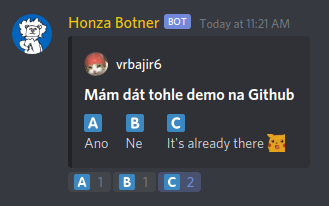

# Botner

## Discord bot pro fakultní server FIT ČVUT

## Co bot vlastně umí

### Authentikace
Pro přístup do školních kanálů je potřeba se nejdříve přihlásit přes školní [OAuth server](https://auth.fit.cvut.cz).
K tomu slouží autentikační zpráva v kanálu **#welcome**. Po úspěšném přihlášení vám bude 
přidělena role **@Authenticated** a získáte přístup k výběru volitelných rolí, které
odemykají školní a jiné kanály.

### Ankety
Bot umí vytvářet ankety v následujících formátech:

#### Yes/no poll

#### ABC poll

### Příkazy pro moderátory

#### Vypsat používanost custom emotes
#### Posílání a editace zpráv, reakce na zprávy
#### Nastavování aktivity

## Instalace, spuštění lokální instance
Dříve Botner využíval Docker, nyní je však hostovaný na heroku a tak využívá Procfile.
Aplikaci lze lokálně spustit podle [oficiálního návodu](https://devcenter.heroku.com/articles/heroku-local). 

Je dobré si nejdříve vytvořit development `.env` upravením `.env.example` a poté ho nalinkovat přes
`heroku local -e .env -f ./Procfile`

Před spuštěním je potřeba ještě vytvořit jar s aplikací pomocí mavenu
`mvn clean package`
